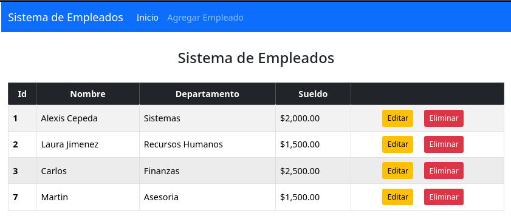
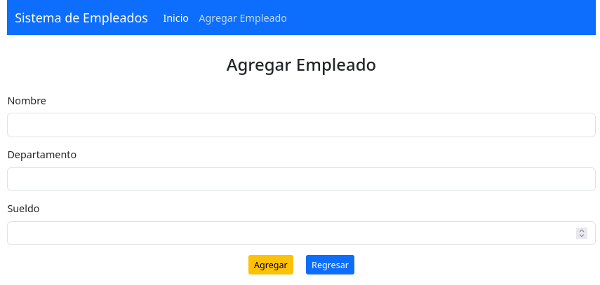

# Sistema de Gestión de Empleados

Ejercicio CRUD desarrollado con Spring Boot para la gestión de empleados, permitiendo registrar, actualizar, listar y eliminar información de manera eficiente.

## Tecnologías utilizadas

### Backend:
- **Spring Boot** con arquitectura MVC.
- **Spring Data JPA** para la gestión de la persistencia.
- **Maven** como gestor de dependencias.
- **MySQL** como base de datos.
- **Lombok** para reducir el código repetitivo y mejorar la legibilidad del proyecto.
- **Spring Web** para la creación de controladores y manejo de peticiones.

### Frontend:
- **JSP (JavaServer Pages)** para la generación de vistas dinámicas.
- **Bootstrap** para agilizar la creación de componentes visuales y garantizar un diseño responsive adaptable a distintos dispositivos.

## Interfaz gráfica del sistema:

